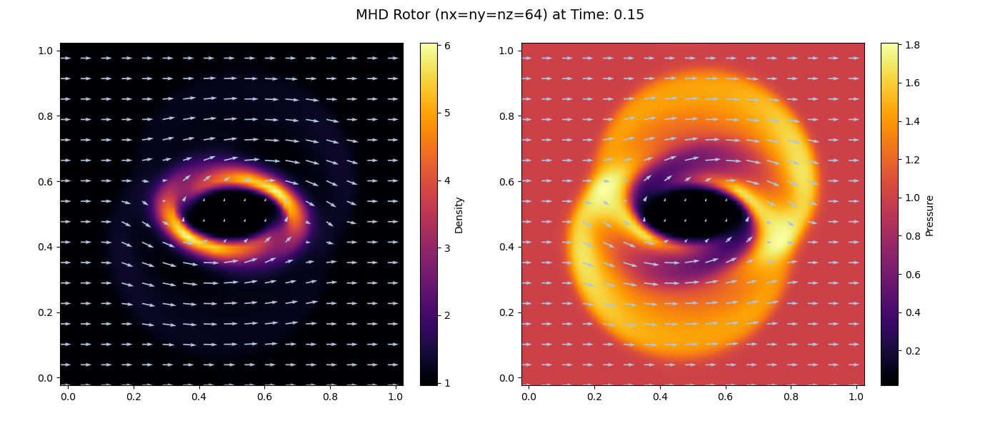

# Magnetohydrodynamics-Demo
## Introduction
I'm developing CUDA-accelerated magnetohydrodynamics software for astrophysical simulations and had finished pure three-dimensional ideal MHD now.
Next, My work will focus on astrophysical features such as self-gravity and radiation transfer.

I made pure 3D ideal MHD part as a demo and uploaded it on release page, introducung usage and contents of demo in this README. Besides, this README is also a developer log for my MHD software development.
By the way, if you are interested in my work about one-dimensional compressible fluid dynamics, please refer this [repository](https://github.com/C-MCheng/CUDA-CompressibleFlow/).  
##Requirements
- OS: Windows-x64 | Linux-x64
- Programming: Python 3 and NumPy
## Software features
- Ahead-of-time compilation (adopting just-in-time compilation in release version in the future)
- Console APP
- HDF5 file I/O
- CPU Parallel computing
- GPU Parallel computing (not integrated in the demo)
## Numerical algorithms
- Finite volume method
- Piecewise linear reconstruction with minmod limiter
- HLLE solver
- MUSCL-Hancock scheme
- unsplit Godunov method
- constrained Transport method
## User guide
### 1. Writing initial conditions into a HDF5 file
The most difficult thing for users is to write a initial state of MHD into a HDF5 file. However, this is just a demo so that I think that users don't want to spend much time to write a code for initial conditions.
Thus, I provide a initial conditions of MHD rotor code with which you can output HDF5 file directly, please download MHDRotor.py in examples folder. The MHD rotor is a classical test problem for multidimensional MHD so I uploaded its initial conditions code.

Let's look the code MHDRotor.py and see what users can modify. 
First, the seventh line `path` is HDF5 files output path. In this software, for not WSL2 OS, files are saved in the folder named data placed in the path includeing exe file and, for WSL2, in the desktop.
Because of storage limit of WSL2, saving files in desktop is more convenient. For example, if you will run this demo on WSL2, you should type `path="/mnt/c/Users/Your_username/Desktop/data/"`.

Then, there are some arguments in the eleventh line:
- `CFL`: This is the Courant–Friedrichs–Lewy number which is lower than 1.0. The lower the CFL is, the more stable numerically the simulation is.
- `evolutionTime`: The evolution time means a time interval the fluid flows from start in the simuation. For initial condition, we set 0.0 usually.
- `n`: n is the number of cells. The space domain is divided by these cells and each cell has a coordinate and physical variables. The more the the number of cells, the more accurate numerically the simulation is.
- `nG`: nG is the number of ghost cell. This must be 2 in the demo due to numerical algorithms.
- `L`: The length of the space domain.
- `gamma`: gamma is heat capacity ratio of fluid. For ideal gas, gamma is 5.0/3.0 and 1.4 for standard Sod shock tube test.

Users can modify `CFL`, `evolutionTime`, `n`, `L` and `gamma` within reasonable value.

Finally, please execute the function `InitializeData()` and I had typed in the 166th line.
### 2. Running a simulation
If you don't have exe file yet. Please go to Releases page in this repository and download a zip file corresponding to your OS. The exe file name is MHD3D, please activate it.
By the way, for Linux-x64 version, you need to execute command line `chomd +x MHD3D` at first time. 

Before running a simulation, users need to follow instructions to key sometings in the console.

You see `Congratulations! All initial settings are already set up successfully. Your simulation starts now!` if all settings are set up successfully and then the software simulates your model until reaching end time you key. 
### 3. Reading and analyzing results
After a simulation, you can read HDF5 files. I also think that users don't want to spend much time to write a code for reading data. Thus, don't worry, I provide a function `DrawData()` in MHDRotor.py.
This function draw density and pressure fields at each step from all HDF5 files in data folder.

Below figure is visualization of 2D slice of MHD rotor test at time = 0.15. Lightblue arrows are magnetic field.

### 4. Restarting a simulaiton
It's very easy to restart a smulation if you have HDF5 files from last turn. You just reactivate exe file again.
However, please note that if you close software or cease simulation abnormally in last turn, you should restart from the second to last step rather than the last because the data may not completed in the last step output.
## Performance
